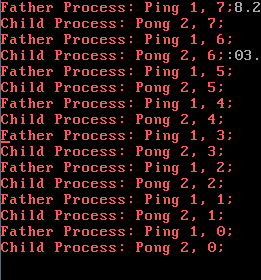
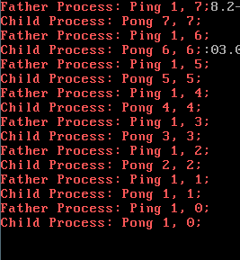

# lab3 实验报告 ： 进程切换

------

                                     姓名：王志邦  
                                   学号：161220131  
                                   日期：2018.05.27

------

## 实验目的

本实验通过实现一个简单的任务调度，介绍基于时间中断进行进程切换完成任务调度的全过程

## 实验任务

在内核中实现进程切换机制，并基于时间中断进行任务调度，具体流程如下  
1. Bootloader从实模式进入保护模式,加载内核至内存，并跳转执行  
2. 内核初始化IDT，初始化GDT，初始化TSS，初始化串口，初始化8259A，...
3. 启动时钟源
4. 加载用户程序至内存
5. 初始化内核IDLE线程的进程控制块（Process Control Block），初始化用户程序的进程控制块
6. 切换至用户程序的内核堆栈，弹出用户程序的现场信息，返回用户态执行用户程序

## 实验流程

本实验基于lab2进行的，所以，加载内核至内存的部分，IDT、GDT、TSS、串口、8259a的初始化任务，加载用户程序至内存的步骤都已经完成了。

+ 首先，本次实验的目的是实现```fork```、```sleep```、```exit```的系统调用，在实验的开始，需要更改用户程序。  

    ```
    #include "lib.h"

    int data = 0;

    int uEntry(void) {
        int ret = fork();
        int i = 8;

        if (ret == 0) {
            data = 2;
            while( i != 0) {
                i --;
                printf("Child Process: Pong %d, %d;\n", data, i);
                sleep(128);
            }
            exit();
        }
        else if (ret != -1) {
            data = 1;
            while( i != 0) {
                i --;
                printf("Father Process: Ping %d, %d;\n", data, i);
                sleep(128);
            }
            exit();
        }

        return 0;
    }

    ```

+ 进程的切换是基于pcb（process control block）实现的，所以，内核中需要维护一个`ProcessTable`结构体：
    1. 关于内核栈`stack`的联合实现，是根据github上的实现copy过来的，由于内核栈需要的空间并不大，其中包括一个`struct TrapFrame tf`并不会影响其功能，并且会为后来`fork`函数的实现提供方便，还能够有效地避免一些由于esp设置不谨慎产生的问题
    2. 使用`ProcessTable`这一数据结构作为进程控制块记录每个进程的信息，其中`stack[MAX_STACK_SIZE]`为每个进程独立的内核堆栈，`tf`记录每个进程从用户态陷入内核态时压入内核堆栈的信息（即所有寄存器信息、中断号、Error Code），`state`记录每个进程的状态（即`RUNNING`、`RUNNABLE`、`BLOCKED`、`DEAD`等），`timeCount`记录每个进程的处理（`RUNNING`）时间片，`sleepTime`记录每个进程阻塞（`BLOCKED`）的时间片，`pid`记录每个进程的进程号
    3. `state`为该`pcb`对应的进程的运行状态，在整个进程工作过程中的状态变化如下：  

        > + 进程由其父进程利用FORK系统调用创建，则该进程进入`RUNNABLE`状态  
        > + 时间中断到来，`RUNNABLE`状态的进程被切换到，则该进程进入`RUNNING`状态  
        > + 时间中断到来，`RUNNING`状态的进程处理时间片耗尽，则该进程进入`RUNNABLE`状态  
        > + `RUNNING`状态的进程利用`SLEEP`系统调用主动阻塞；或利用系统调用等待硬件I/O，则该进程进入`BLOCKED`状态  
        > + 时间中断到来，`BLOCKED`状态的进程的`SLEEP`时间片耗尽；或外部硬件中断表明I/O完成，则该进程进入`RUNNABLE`状态  
        > + `RUNNING`状态的进程利用`EXIT`系统调用主动销毁，则该进程进入`DEAD`状态  

```
                                +------------+
            SLEEP TIME EXPIRED   |            |        SLEEP SYSCALL
            I/O FINISHED  +---+  BLOCKED   +<--+  I/O REQUEST SYSCALL
                            |   |            |   |
                            |   +------------+   |
                            V                    |
+------------+ FORK    +-----+------+      +------+-----+ EXIT    +------------+
|            | SYSCALL |            +<-----+            | SYSCALL |            |
|     NEW    +-------->+  RUNNABLE  |      |  RUNNING   +-------->+    DEAD    |
|            |         |            +----->+            |         |            |
+------------+         +------------+      +------------+         +------------+
```


代码实现如下：

```
#define MAX_STACK_SIZE (16 << 10)

enum { BLOCKED, DEAD, RUNNING, RUNNABLE };

struct ProcessTable {

    union{
        uint8_t stack[MAX_STACK_SIZE];
        struct {
            uint8_t pad0[MAX_STACK_SIZE - sizeof(struct TrapFrame)];
            struct TrapFrame tf;
        };
    };
    int state;
    int timeCount;     
    int sleepTime;
    uint32_t pid;
};
```

+ 由于用户程序中仅有两个进程，为了简化进程切换的过程，降低实现的难度，我仅申请了两个`pcb`用来分别记录父子进程的状态，并利用变量`current`记录当前运行的进程  

    ```
    struct ProcessTable pcb[2];
    int current;
    ```

+ 由于进程切换过程，是依托于时间中断的轮流调度，所以需要对`8253`可编程计时器进行设置，使得`8253`以频率HZ产生时间中断信号发送给8259A可编程中断控制器，启动时钟源代码如下：  

    ```
    #define TIMER_PORT 0x40
    #define FREQ_8253 1193182
    #define HZ 100

    void initTimer() {
        int counter = FREQ_8253 / HZ;
        outByte(TIMER_PORT + 3, 0x34);
        outByte(TIMER_PORT + 0, counter % 256);
        outByte(TIMER_PORT + 0, counter / 256);
    }
    ```

+ 由于，lab3引入进程的概念，在从内核进入用户程序之前，首先要创建用户进程：
    ```
    void enterUserSpace(uint32_t entry) {
    	struct ProcessTable *p = &pcb[0];
    	asm volatile("movl %0, %%eax":: "r"(USEL(SEG_UDATA)));
    	asm volatile("movw %ax, %ds");
    	asm volatile("movw %ax, %es");
    	asm volatile("movw %ax, %fs");

    	p->tf.ss = USEL(SEG_UDATA);
    	p->tf.esp = 0x200000 + (1 << 16);

    	asm volatile("pushfl");

    	p->tf.cs = USEL(SEG_UCODE);
    	p->tf.eip = entry;
    	p->state = RUNNING;
    	p->sleepTime = 0;
    	p->timeCount = 16;
    	p->pid = 520;
    	current = 0;
    	ProcessNum = 1;

    	asm volatile("movl %0, %%esp" ::"r"(&p->tf.eip));
    	asm volatile("iret");
    }
    ```

+ __系统调用：`fork`、`sleep`、`exit`实现__
    - `fork`
        - `fork`系统调用用于创建子进程，内核需要为子进程分配一块独立的内存，将父进程的地址空间、用户态堆栈完全拷贝至子进程的内存中，并为子进程分配独立的进程控制块，完成对子进程的进程控制块的设置  
        - 若子进程创建成功，则对于父进程，该系统调用的返回值为子进程的pid，对于子进程，其返回值为0  
        - `fork`的系统调用过程：  
            1. 由用户程序调用`fork`函数，`fork`的系统调用号为 __2__，不需要其他参数传入
                ```
                int fork(){
            	   return syscall(2, 0, 0);
                }
                ```
            2. 通过`int 0x80`陷入中断，调用`sys_fork`
                ```
                void sys_fork(struct TrapFrame *tf){

                	struct ProcessTable *p = &pcb[1];
                	struct ProcessTable *q = &pcb[0];
                	int i;
                	for(i = 0; i < MAX_STACK_SIZE; ++i)
                		p->stack[i] = q->stack[i];

                	uint32_t src = 0x200000;
                	uint32_t dest = 0x210000;
                	for(i = 0; i < 0x10000; ++i)
                		*(uint8_t*)(dest + i) = *(uint8_t*)(src + i);
                	p->pid = q->pid + 1;
                	p->sleepTime = 0;
                	p->timeCount = 16;
                	p->state = RUNNABLE;
                	ProcessNum++;
                	p->tf.eax = 0;
                	q->tf.eax = p->pid;
                }
                ```
            3. 创建子进程成功之后，返回用户进程继续执行，之后，利用时间中断对两个进程进行调度
    - `sleep`
        - `sleep`系统调用用于进程主动阻塞自身，内核需要将该进程由`RUNNING`状态转换为`BLOCKED`状态，设置该进程的`sleepTime`时间片，并切换运行其他`RUNNABLE`状态的进程
        -  `sleep`的系统调用过程：
            1. 由用户进程调用`sleep`函数，`sleep`函数的系统调用号为__200__，`sleep`时需要设置`sleepTime`时间片，这个值需要通过参数传入
                ```
                void sleep(uint32_t seconds){
                	syscall(200, seconds, 0);
                }
                ```
            2. 通过`int 0x80`陷入中断，调用`sys_sleep`
                ```
                void sys_sleep(struct TrapFrame *tf){
                	pcb[current].sleepTime = tf->ebx;
                	pcb[current].state = BLOCKED;
                	current = -1;
                	schedule();
                }
                ```
    - `exit`
        - `exit`系统调用用于进程主动销毁自身，内核需要将该进程由`RUNNING`状态转换为`DEAD`状态，回收分配给该进程的内存、进程控制块等资源，并切换运行其他`RUNNABLE`状态的进程
        - `exit`的系统调用过程：
            1. 由用户程序调用`exit`函数，`fork`的系统调用号为 __1__，不需要其他参数传入
                ```
                void exit(){
                	syscall(1, 0, 0);
                }
                ```
            2. 通过`int 0x80`陷入中断，调用`sys_exit`
                ```
                void sys_exit(struct TrapFrame *tf){
                	pcb[current].state = DEAD;
                	current = -1;
                	ProcessNum -= 1;
                	schedule();
                }
                ```
+ __`schedule`任务调度函数的实现__：
    - 在父子进程产生之后，需要轮流调度两个进程进行运行，这种轮流调度，依靠的是时钟中断来进行。
        - 由计时器定时产生时钟中断，调用`timerHandle`函数，对时钟中断进行处理
            ```
            case 0x20:
    			timerHandle(tf);
    			break;
            ```
    - 每次时钟中断要对两个进程的时间片（`sleepTime` & `timeCount`）进行操作。
        - 对于`statue == BLOCKED’的进程，对其`sleepTime`进行自减，直到‘sleepTime == 0’，`sleep`结束，进程状态更改为`RUNNABLE`
        - 对于`state == RUNNING`的进程，对其`timeCount`进行自减，直到`timeCount == 0`，说明该进程时间片用尽，需要轮换另一个进程进行运行
            ```
            void timerHandle(struct TrapFrame *tf){
            	//panic_i(pcb[0].sleepTime);
            	if(pcb[0].sleepTime > 0)
            		if(--pcb[0].sleepTime == 0)
            			pcb[0].state = RUNNABLE;

            	if(pcb[1].sleepTime > 0)
            		if(--pcb[1].sleepTime == 0)
            			pcb[1].state = RUNNABLE;

            	if(current == -1){
            		schedule();
            		return ;
            	}

            	pcb[current].timeCount -= 1;
            	if(pcb[current].timeCount == 0){
            		pcb[current].state = RUNNABLE;
                    pcb[current].timeCount = 16;
                    schedule();
            	}
            	return ;
            }
            ```
    - `shedule`函数的作用过程：
        - 确定下一个运行的进程是哪一个：
            - 如果当前没有进程的`state == RUNNING`， 选择两个进程中`state == RUNNABLE`的那一个
                ```if(current == -1){
                    if(pcb[0].state == RUNNABLE)
                        current = 0;
                    else if(pcb[1].state == RUNNABLE)
                        current = 1;
                }
                ```
            - 如果当前有进程的`state == RUNNING`， 若另一个进程`state == RUNNABLE`，切换为另一个进程，否则依旧运行当前进程
                ```else{
                    if(current == 0 && pcb[1].state == RUNNABLE)
                        current = 1;
                    else if(current == 1 && pcb[0].state == RUNNABLE)
                        current = 0;
                }
                ```
            - 如果，上述步骤进行完毕，`current == -1`，说明此时，没有进程处于就绪状态，此时需要切换至以下内核`IDLE线程`，该线程调用`waitForInterrupt()`执行`hlt`指令，`hlt`会使得CPU进入暂停状态，直到外部硬件中断产生
                ```
                /* 将CPU置入休眠状态直到下次中断到来 */
                static inline void waitForInterrupt() {
                	asm volatile("hlt");
                }
                void IDLE() {
                    asm volatile("movl %0, %%esp;" ::"i"(0x200000));
                    asm volatile("sti");
                    while(1)
                        waitForInterrupt();
                }
                ```
        - 下一个运行的进程确定之后，保存当前进程的状态，并设置`esp0：ss0`、`段寄存器`，然后执行`iret`进入当前进程
            ```
            tss.esp0 = (uint32_t)&(pcb[current].stack[MAX_STACK_SIZE]);
            tss.ss0 = KSEL(SEG_KDATA);

            gdt[SEG_UCODE] = SEG(STA_X | STA_R, current * (1 << 16), 0xffffffff, DPL_USER);
            gdt[SEG_UDATA] = SEG(STA_W,         current * (1 << 16), 0xffffffff, DPL_USER);

            asm volatile("pushl %eax");
            asm volatile("movl %0, %%eax" ::"r"(USEL(SEG_UDATA)));
            asm volatile("movw %ax, %ds");
            asm volatile("movw %ax, %es");
            asm volatile("popl %eax");

            asm volatile("movl %0, %%esp" ::"r"(&pcb[current].tf));
            asm volatile("popl %gs");
            asm volatile("popl %fs");
            asm volatile("popl %es");
            asm volatile("popl %ds");
            asm volatile("popal");
            asm volatile("addl $4, %esp");
            asm volatile("addl $4, %esp");

            asm volatile("iret");
            ```

## 运行结果



## 实验过程中遇到的一些问题

### __输出错误__：

+ __运行结果__：  
      
+ __产生原因__：  
    lab2中仅有一个用户进程，所以在寻址的时候无需从线性地址转换为物理地址，但是，在lab3中，两个用户进程之间的存在偏移量，所以，在对地址进行处理的时候，要考虑到分段带来的影响：
+ __解决方法__：  
    将`char ch = *(char*)(tf->ebx+ i);`更改为`char ch = *(char*)(tf->ebx + (current) * (1 << 16) + i);`

### __GP产生__：

+ __产生原因__：
    在`doirq.S`中由于更改了`struct TrapFrame`的结构，所以在压栈的时候，需要对其压入的内容与压栈的顺序进行修改：
+ __解决方法__：
    ```
    .global asmDoIrq
    asmDoIrq:
    	pushal // push process state into kernel stack
    	pushl %esp
    	call irqHandle
    	addl $4, %esp
    	popal
    	addl $4, %esp //interrupt vector is on top of kernel stack
    	addl $4, %esp //error code is on top of kernel stack
    	iret
    ```
    __替换为：__
    ```
    .global asmDoIrq
    asmDoIrq:
    	pushal # push process state into kernel stack
    	pushl %ds
    	pushl %es
    	pushl %fs
    	pushl %gs
    	pushl %esp
    	call irqHandle
    	addl $4, %esp
    	popl %gs
    	popl %fs
    	popl %es
    	popl %ds
    	popal
    	addl $4, %esp //interrupt vector is on top of kernel stack
    	addl $4, %esp //error code is on top of kernel stack
    	iret
    ```
